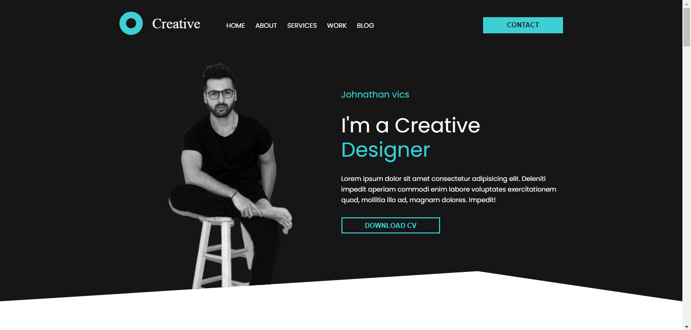
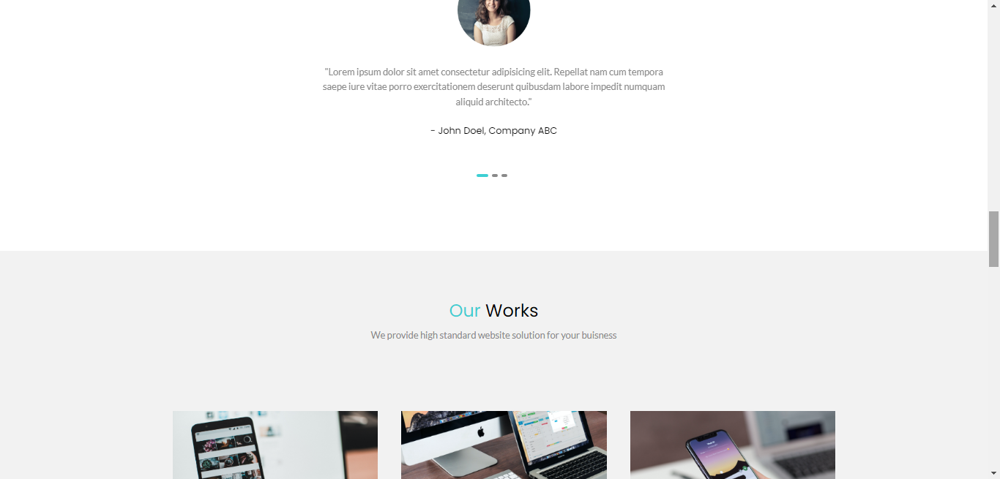
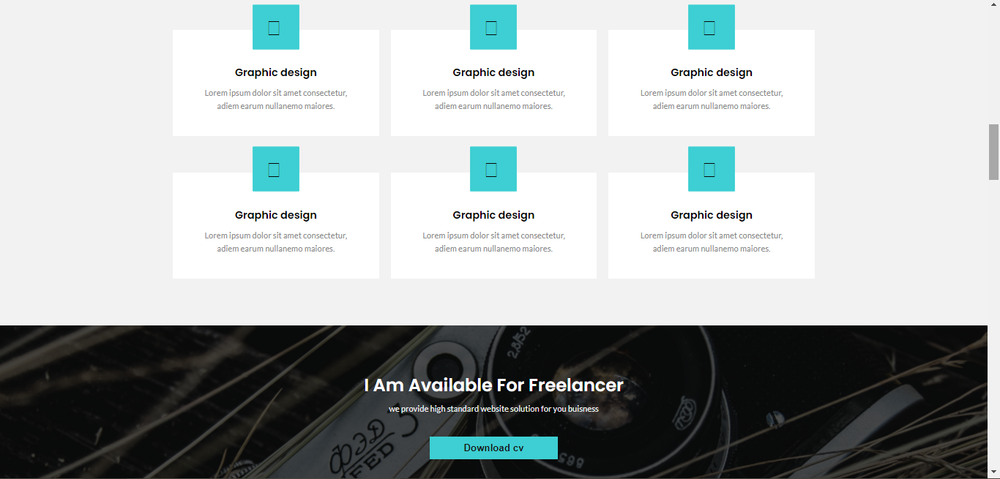
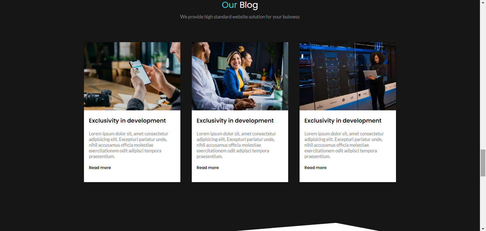
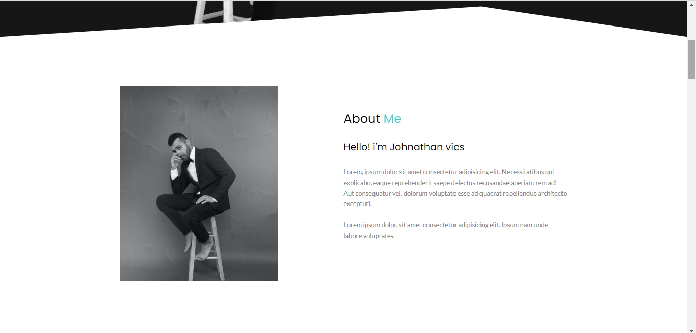
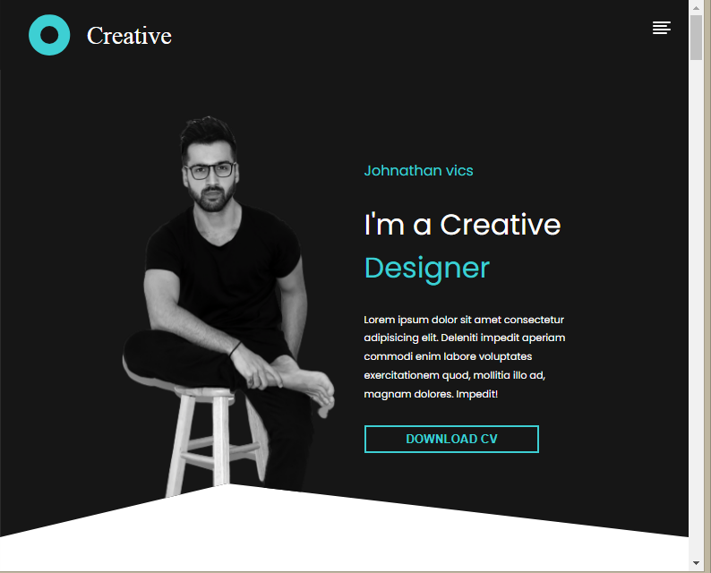
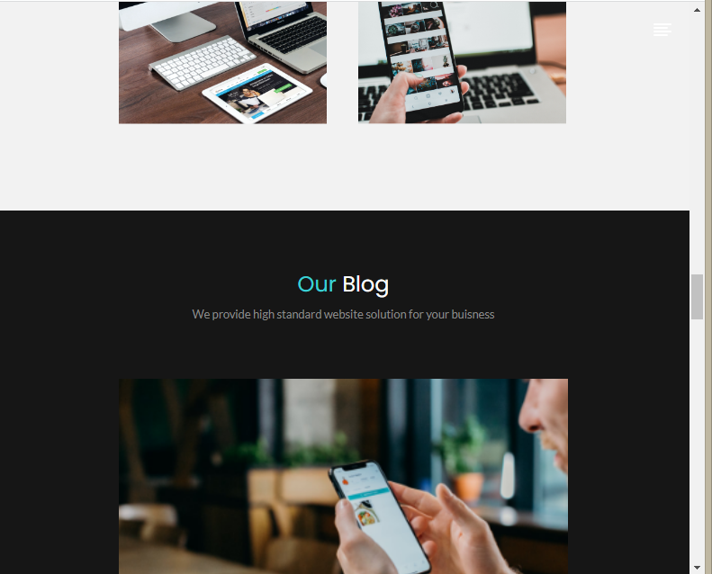
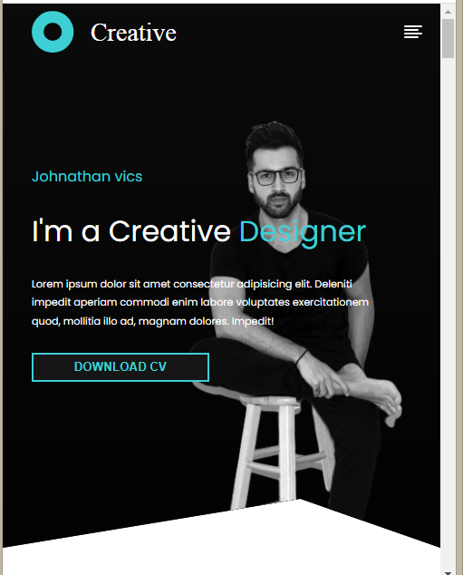
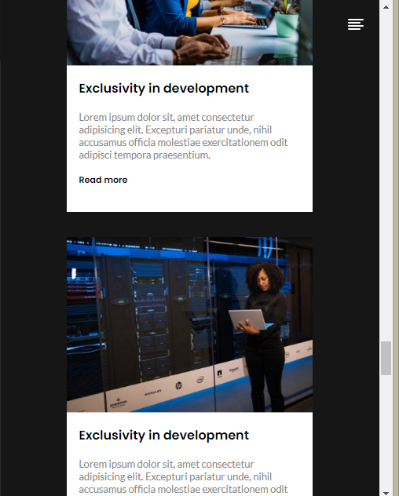
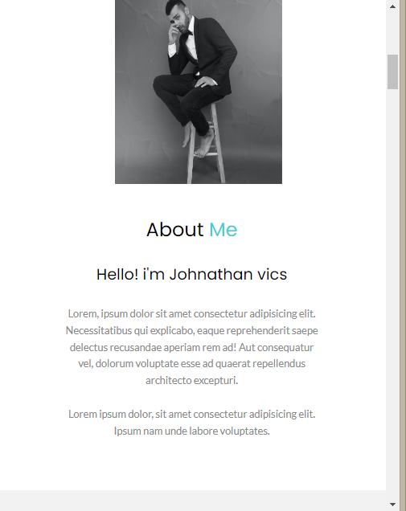

# portfolio website

This is a mobile-first responsive portfolio website UI made for practice.

## Table of contents

- [Overview](#overview)
  - [Objective](#Objective)
  - [Screenshot](#screenshot)
- [My process](#my-process)
  - [Built with](#built-with)
  - [What I learned](#what-i-learned)
- [Author](#author)

## Overview

### Objective

Users should be able to:

- View the optimal layout depending on their device's screen size

### Screenshot

## My process

### Built with

- Semantic HTML5 markup
- CSS custom properties
- Flexbox
- CSS Grid
- Mobile-first workflow
- CSS animations
- slick slider
- Basic dom

### What I learned

Here i learned a lot about mobile first responsive design and how to achieve it also learned quite about element position properties some grid based css and responsive units and also about a special css prop which is clip-path which helps to make a sharp angle polygon also learned about mobile navigation and links animation by scroll-behaviour.

## Author

It was a tutorial based learning, inspired by coder's gyan.

- tutorial - [Create a Personal Portfolio website using html and css step by step in Hindi in 2020 🔥🔥](https://youtu.be/8r1MHZec4Hc)
